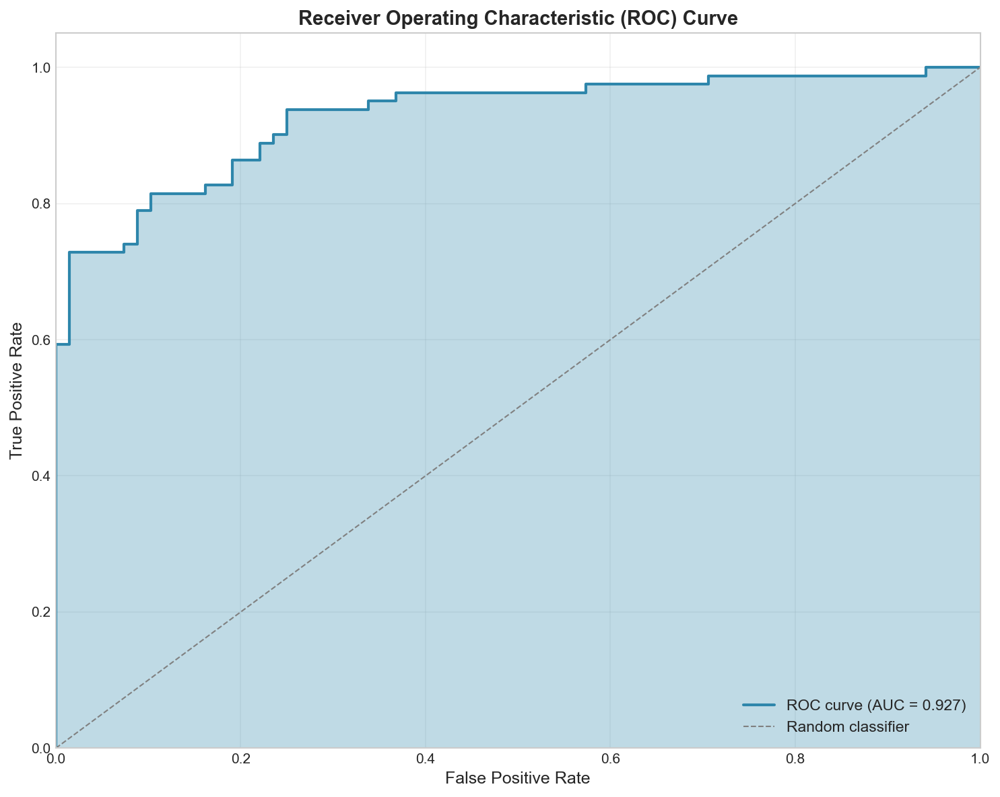
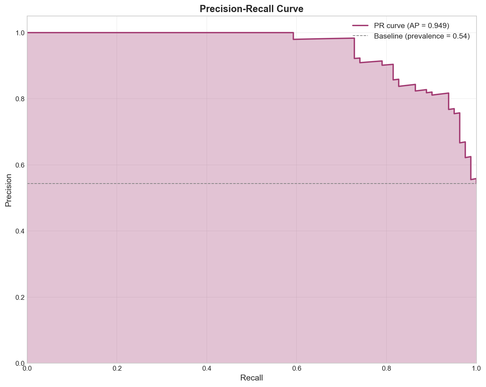
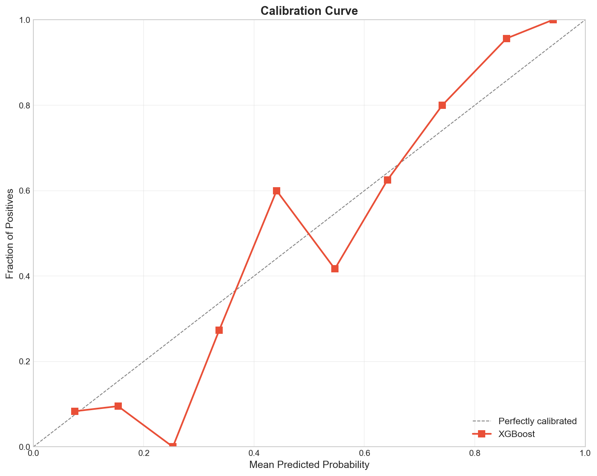
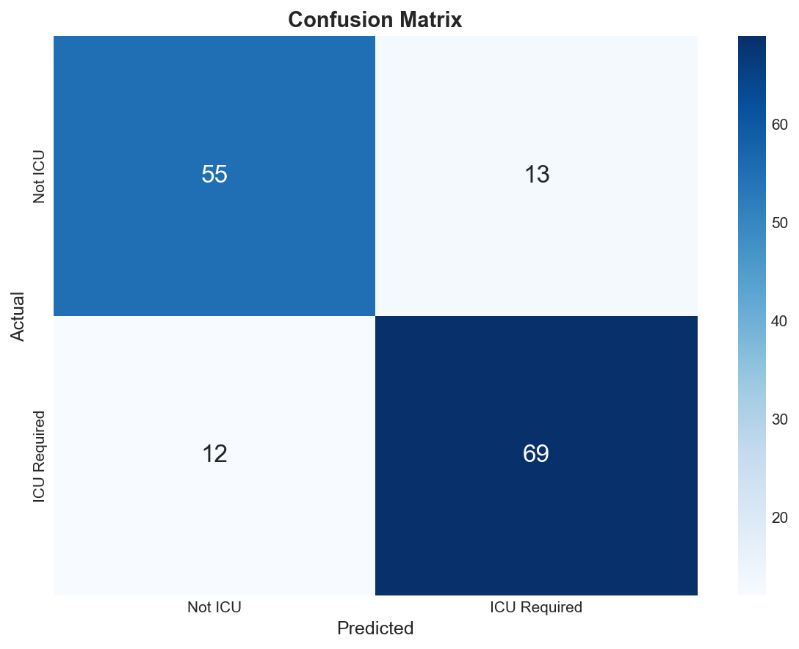
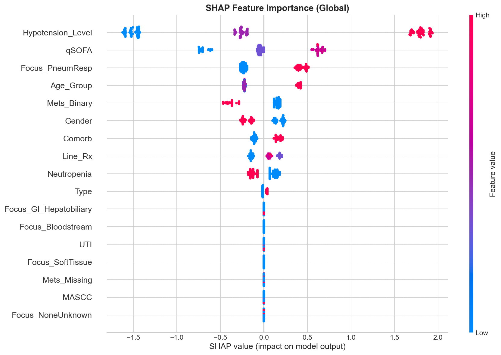

<p align="center">
  <h1 align="center">🏥 ICU Admission Prediction for Febrile Oncology Patients</h1>
  <p align="center">
    <strong>A machine learning model to predict ICU requirements in cancer patients with febrile illness</strong>
  </p>
  <p align="center">
    <a href="#results"></a>
    <a href="#results"></a>
    <a href="#results"></a>
  </p>
</p>

---

## 📋 Overview

Febrile neutropenia in oncology patients can rapidly progress to sepsis and multi-organ failure. Early identification of patients requiring ICU admission enables timely intervention and improved outcomes.

This project develops an **XGBoost-based predictive model** using clinical features available at initial presentation to identify high-risk patients who may require ICU-level care.

### 🎯 Key Highlights

- **High Discrimination**: AUROC of 0.925 demonstrates excellent predictive ability
- **Robust Validation**: 10-repeat 5-fold stratified cross-validation with bootstrap confidence intervals
- **Interpretable**: SHAP-based feature importance for clinical transparency
- **Sensitivity Analysis**: Includes model variant excluding hypotension (for earlier-stage prediction)

---

## 📊 Results

<a name="results"></a>

### Model Performance

| Metric | Value | 95% CI |
|:-------|:-----:|:------:|
| **AUROC** | 0.925 | [0.913, 0.936] |
| **AUPRC** | 0.948 | [0.941, 0.955] |
| **Accuracy** | 83.2% | [81.7%, 84.5%] |
| **F1 Score** | 0.845 | [0.831, 0.857] |
| **Sensitivity** | 85.2% | — |
| **Specificity** | 80.9% | — |

### 📈 Visualizations

<table>
  <tr>
    <td align="center"><strong>ROC Curve</strong></td>
    <td align="center"><strong>Precision-Recall Curve</strong></td>
  </tr>
  <tr>
    <td></td>
    <td></td>
  </tr>
  <tr>
    <td align="center"><strong>Calibration</strong></td>
    <td align="center"><strong>Confusion Matrix</strong></td>
  </tr>
  <tr>
    <td></td>
    <td></td>
  </tr>
</table>

### 🔍 Feature Importance

The model identifies key clinical predictors of ICU requirement:

| Rank | Feature | Description |
|:----:|---------|-------------|
| 1 | **Hypotension Level** | Severity of blood pressure drop |
| 2 | **qSOFA Score** | Quick Sepsis-related Organ Failure Assessment |
| 3 | **Metastatic Status** | Presence of metastatic disease |
| 4 | **Comorbidity Burden** | Number/severity of comorbidities |
| 5 | **Respiratory Focus** | Pneumonia or respiratory infection source |

<p align="center">
  
</p>

---

## 🚀 Quick Start

### Prerequisites

- Python 3.8+
- pip or conda

### Installation

```bash
# Clone the repository
git clone https://github.com/LlamaGoneRogue/icu2.git
cd icu2

# Create virtual environment
python3 -m venv venv
source venv/bin/activate  # On Windows: venv\Scripts\activate

# Install dependencies
pip install -r requirements.txt
```

### Running the Pipeline

```bash
# Option 1: Run steps individually
python src/data_prep.py      # Data preparation & validation
python src/train.py          # Train XGBoost model
python src/evaluate.py       # Generate evaluation metrics & plots

# Option 2: Run complete pipeline
python pipelines/pipeline.py --local
```

### AWS SageMaker Deployment

```bash
# Create/update SageMaker pipeline
python pipelines/pipeline.py --create --role <your-sagemaker-role-arn>

# Execute pipeline
python pipelines/pipeline.py --execute --role <your-sagemaker-role-arn>
```

---

## 📁 Project Structure

```
icu2/
├── 📂 src/                          # Source code
│   ├── data_prep.py                 # Data ingestion & validation
│   ├── train.py                     # XGBoost training with CV
│   ├── train_no_hypotension.py      # Sensitivity analysis training
│   ├── evaluate.py                  # Evaluation & visualization
│   ├── evaluate_no_hypotension.py   # Sensitivity analysis evaluation
│   ├── validation.py                # Data validation utilities
│   ├── diagnostics.py               # Model diagnostics
│   └── publication_analysis.py      # Publication-ready outputs
│
├── 📂 pipelines/                    # Pipeline definitions
│   └── pipeline.py                  # SageMaker Pipeline
│
├── 📂 data/                         # Data storage
│   ├── processed_data.csv           # Preprocessed dataset
│   └── data_validation_report.json  # Data quality report
│
├── 📂 output/                       # Model outputs
│   ├── metrics.json                 # CV metrics with CIs
│   ├── xgboost_model.pkl            # Trained model
│   ├── REPORT.md                    # Evaluation report
│   ├── COMBINED_REPORT.md           # Combined analysis report
│   ├── 📂 plots/                    # Visualization outputs
│   ├── 📂 no_hypotension/           # Sensitivity analysis results
│   └── 📂 publication/              # Publication materials
│
├── 📄 RESEARCH_PLAN.md              # Research methodology
├── 📄 requirements.txt              # Python dependencies
└── 📄 README.md                     # This file
```

---

## ⚙️ Model Configuration

### XGBoost Hyperparameters

| Parameter | Value | Rationale |
|-----------|:-----:|-----------|
| `max_depth` | 3 | Conservative to prevent overfitting on small dataset |
| `learning_rate` | 0.1 | Standard learning rate |
| `n_estimators` | 100 | Sufficient for convergence |
| `subsample` | 0.8 | Row sampling for regularization |
| `colsample_bytree` | 0.8 | Feature sampling for regularization |
| `min_child_weight` | 5 | Minimum samples per leaf |
| `reg_alpha` | 0.1 | L1 regularization |
| `reg_lambda` | 1.0 | L2 regularization |

### Cross-Validation Strategy

- **Method**: Repeated Stratified K-Fold
- **Folds**: 5
- **Repeats**: 10
- **Total Iterations**: 50
- **Confidence Intervals**: Bootstrap (1000 iterations)

---

## 📚 Outputs & Reports

| Output | Description |
|--------|-------------|
| `output/REPORT.md` | Comprehensive evaluation report |
| `output/COMBINED_REPORT.md` | Combined analysis with sensitivity results |
| `output/publication/MANUSCRIPT.html` | Publication-ready manuscript |
| `output/publication/POSTER.html` | Research poster |
| `output/publication/NCSEF_PRESENTATION.html` | Presentation slides |

---

## ⚠️ Limitations & Disclaimers

> **⚠️ RESEARCH USE ONLY**
> 
> This model is for research purposes only and has **NOT been validated for clinical use**.

### Known Limitations

1. **Sample Size**: Small cohort (~149 patients) limits generalizability
2. **Single-Center**: Data from one institution may not generalize to other settings
3. **No Temporal Validation**: Prospective validation not yet performed
4. **Feature Dependence**: Model heavily relies on hypotension, which may limit early prediction

### Future Work

- [ ] Multi-center external validation
- [ ] Prospective clinical trial
- [ ] Integration with EHR systems
- [ ] Real-time risk scoring dashboard

---

## 📄 Citation

If you use this work, please cite:

```bibtex
@software{icu_prediction_2026,
  title = {ICU Admission Prediction for Febrile Oncology Patients},
  author = {Iyer, Aditya},
  year = {2026},
  url = {https://github.com/LlamaGoneRogue/icu2}
}
```

---

## 📜 License

This project is for **research purposes only**. Clinical implementation requires prospective validation and regulatory approval.

---

<p align="center">
  Made with ❤️ for improving oncology patient outcomes
</p>
